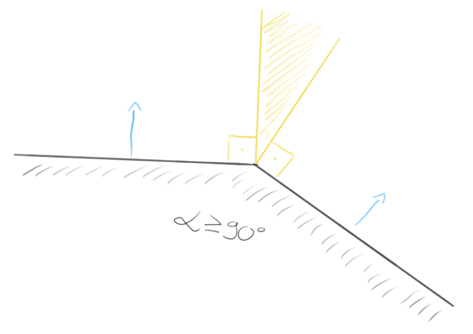
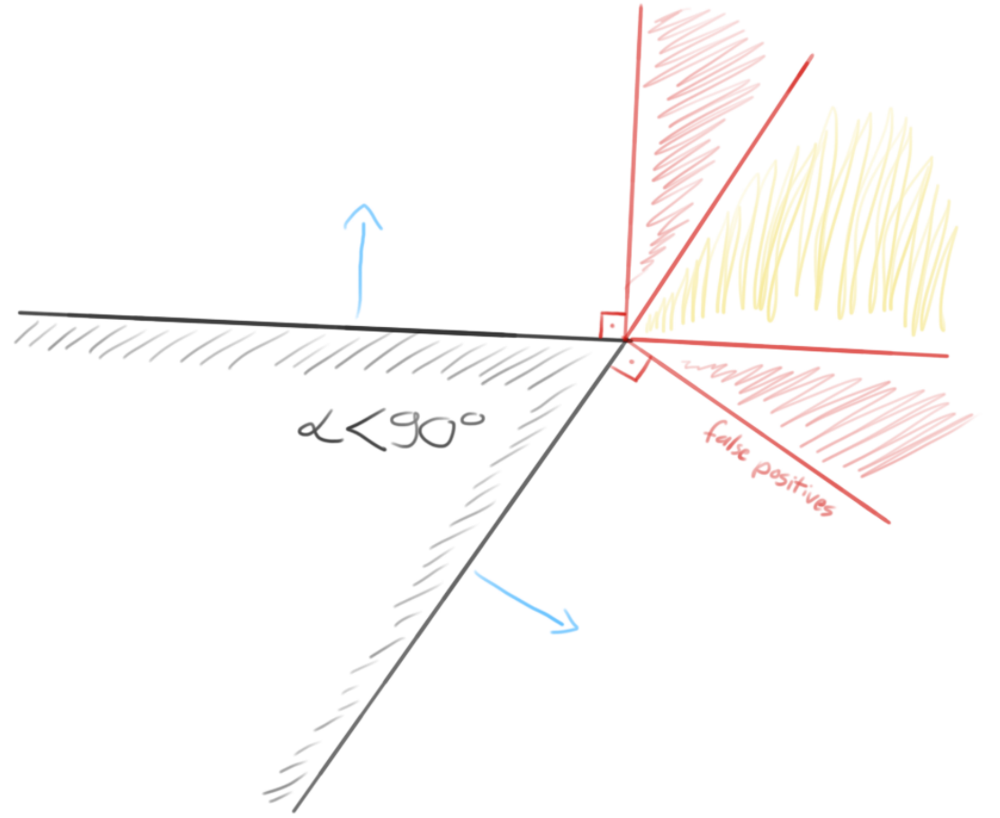
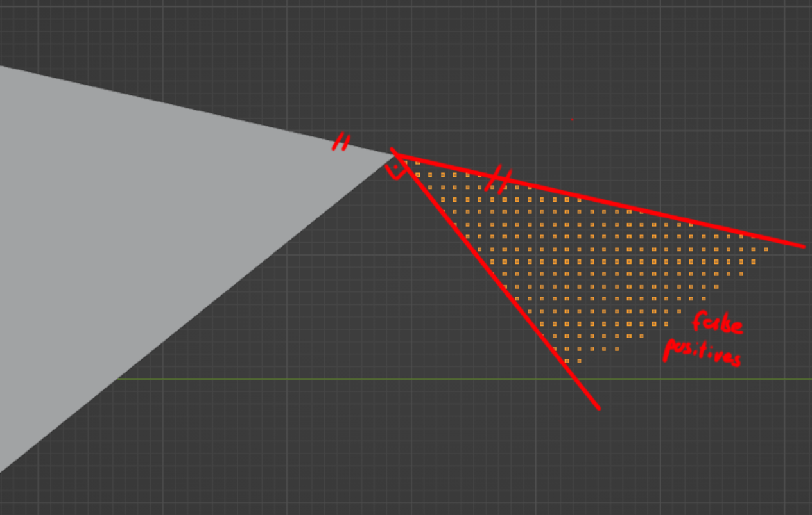
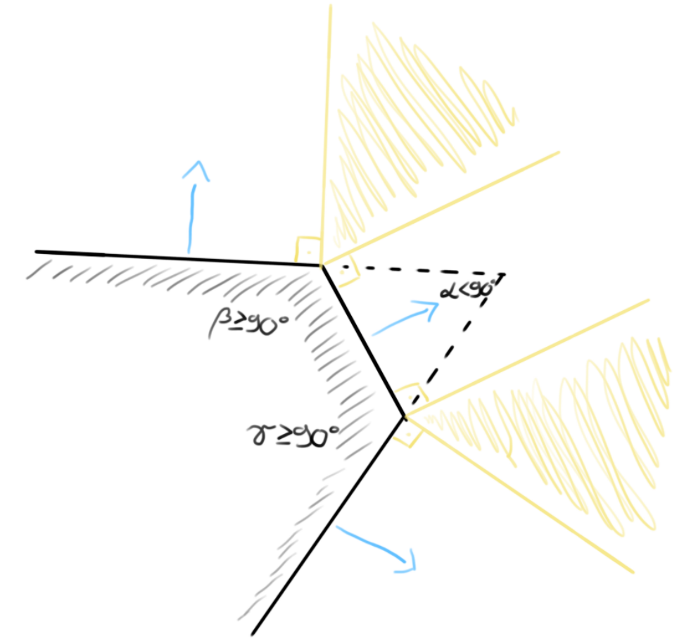

# Hitpoint generation notes

Hitpoint clouds are generated in two general steps:

1. Generating full 3D grid with given spacing inside the bounding box
2. Filtering out points that are outside the mesh boundaries

## Filtering methods

There are two basic methods to decide whether a point is inside a polygon mesh.

The first approach is the ray casting method, where a ray is shot from the checked point in an arbitrary direction, and the intersections with the mesh boundary are counted. If the ray crosses the boundary an odd number of times, the point is inside, otherwise it's outside.

The second method is based on finding the closest point on the mesh to the checked point, and then using position and normal vectors to decide wether the point is behind the face (inside the mesh), or in front of it (outside the mesh). A basic Blender specific implementation of this solution is discussed on [Salai Vedha Viradhan's blog](https://salaivv.com/2023/04/12/point-inside-outside).

The point filtering in A3OB is implemented with the latter method, but there are a few caveats that needed to be addressed.

## Non closed meshes

The face normal based approach assumes that a mesh is closed, and has consistent normals. If a face is missing, or the normal of a face is flipped, the results will have false positive points (points that are clearly outside the mesh, but weren't recongnized as such).

The only way to avoid this limitation is to make sure, that the mesh is closed and consistently oriented.

## Edge cases

The bigger issue with this method is that there are literal "edge cases".

On polygon meshes, an external point might not always be precisely in front of any face of the mesh. In these cases the closest point on the mesh will be on an edge. Since edges can't have normal vectors, the calculation returns the normal of one of the faces (probably of the face with the smaller index). In cases where the internal angle between the faces is **at least** 90° no error occures, because the point is still in front of the planes of both faces.

Problems arise when internal angles are below 90°. In these cases the calculation may produce false positives in two areas. These areas are symmetrically located on the two sides of the joining edge, between the planes of the faces, and the normal directions. Points in these areas may get flagged as being inside the mesh, even when they are clearly outside. This happens when the point is behind the plane of the face whose face normal it was assigned, but not yet fully in front of the other face.

In the context of hitpoint cloud generation, the problem can be solved by performing a chamfer operation (single segment bevel) on all edges. This ensures that the internal angles at all face connections are at least 90°, therefore eliminating the potentially false positive areas.

This solution is acceptable here because the point sampling is fairly regular, sparse, and with a small enough chamfer offset, it results in virtually no false negatives. With that being said, it's not a rigorous solution, but it's ***good enough***.

