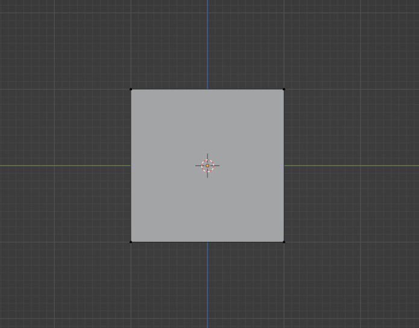
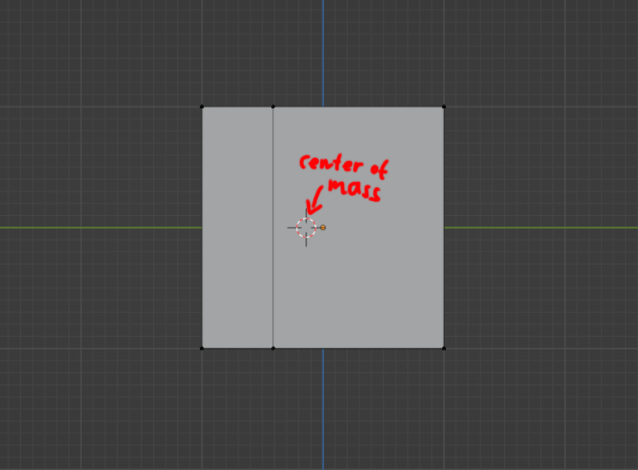
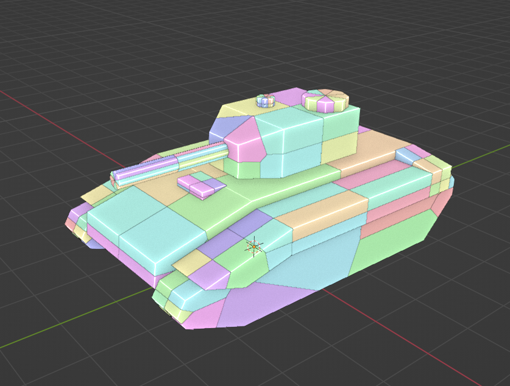
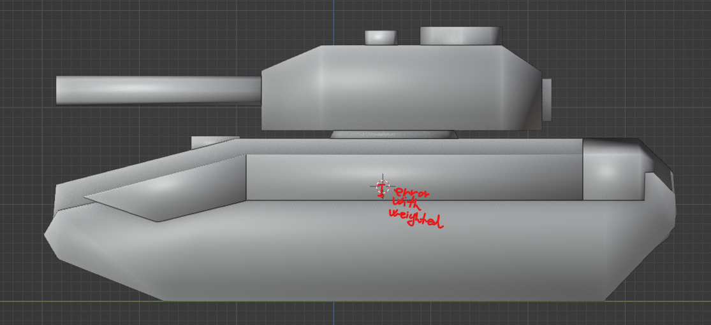

# Vertex Mass Editing notes

The simplest form of editing the vertex masses of a mesh is a assigning a specific value to each vertex. This method is sufficient if the goal is to just have some measure of mass set on all vertices, but might not be good for more complex cases.

## Uniform distribution

A more realistic scenario is when the overall desired mass of an object is known, and needs to be distributed across the vertices of the geometry LOD. The simplest form of this is uniform distribution among all vertices. The predetermined mass is simply equally divided up and assigned to each vertex. This solution obviously achieves the targeted overall mass, but can produce a distribution that might not be acceptable in certain cases. The center of mass will not be where one might expect, which can be a real problem for vehicles.

When all vertices have equal mass values, the spatial distribution of a the vertices determines the center of mass. In one of the simplest examples, when assigning a mass to a cube, the logical expectation would be, that the center of mass is in the geometric center.

This is not the case with uniform mass distribution, if the cube is asymmetrically subdivided for whatever reason. The center of mass will be "attracted" to those parts of the mesh that have more vertices.

## Weighted distribution

The way to account for the shortcomings of the uniform distribution method is to account not only for the number of vertices, but also the area they are expected to influence on the mesh. Using this information, the distribution can be weighted such that vertices that represent a larger volume of the shape are assigned higher mass values. This gives a better approximation of the mass distribution.

### Volume cells

The volume a vertex represents can be calculated from a 3D Voronoi diagram. Voronoi diagrams are closely related to Delaunay triangulation, and they are well understood and established in 2D. Sadly, their 3D application presents unique problems. To effectively calculate a Voronoi cell diagram of a 3D mesh, 3D Delaunay tetrahedralization would have to be computed, which is not as straight forward as its 2D triangulation counterpart.

### Calculating the cells

To avoid the need to implement the complex process of tetrahedralization, the addon currently follows a naive and extremely inefficient, but a conceptually very simple method (given the already implemented Blender Python functions). The Voronoi cells are constructed by actual mesh geometry editing operations (continual bisections).

The mesh cells in a given closed mesh component are generated as follows:

1. a KD tree of the entire component is created to speed up spatial queries
2. for each vertex:
   1. all mesh vertices are sorted by their distance to the current cell center vertex in ascending order
   2. vertices are iterated from closest to farthest, and the mesh is continually bisected with perpendicular bisector planes between the points and the center vertex
   3. after each bisection, the radius of the bounding sphere of the remaining geometry is calculated, points farther than twice the radius are excluded from the iterations
   4. after all bisections are done, the Voronoi cell remains

The inefficiency of this solution is mainly twofold. Firstly it uses actual geometric computations which are costly to execute. Secondly, even without considering the cost of the  geometric computations, the number of bisections increases exponentially the more vertices a mesh has, as a cell has to be calculated at each vertex, and each vertex must be taken into account for every other cell as well.

The latter part is somewhat improved by the bounding sphere radius filtering. If a particular point is at least twice as far from the center vertex as the radius of the bounding sphere, the bisection at the halfway point can in no way result in any actual altered geometry. This potentially cuts down the number of bisections to calculate to arrive at the final Voronoi cell, but in most cases it still results in a lot more calculations than actually needed. Sadly, this is the only plausible filtering method, short of actually calculating the tetrahedralization (which would let us know exactly which points actually need to be used for the bisections).

Overall the method has mostly acceptable speeds on typical geometry LODs and components, as they are generally very simple, with very few vertices. That being said, the inefficiency very quickly starts to show even from 500 (most relevant source meshes are still way below this) vertices.

### Remaining errors

While the weighting with cell volumes does improve the "realism" of the distribution, it's still an approximation. The resulting center of mass will still be off from the volumetric centroid for irregular shapes.

Difference between volumetric centroid and center of mass with uniform distribution:

Difference between volumetric centroid and center of mass with weighted distribution:

Theoretically it should be possible to calculate an accurate distribution (preserving the volumetric centroid as the center of mass). The centroid, volume and overall mass of the shape can be calculated, and the positions of the mass points are also known, but deriving an actual process for this is harder than it looks. So for the time being, the cell volume weighted solution is the best course.
